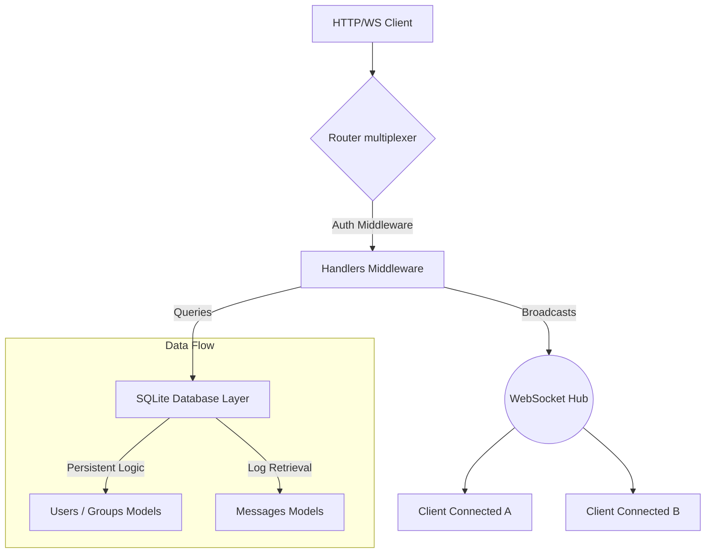

# Social Network - Backend

The core application API, database service, and real-time WebSocket publisher for the Social Network platform.

Built with pure Go (Golang) leveraging powerful high-concurrency Goroutines, built-in standard HTTP multiplexers, and a scalable SQLite relational data store.

## 🛠️ Technology Stack

- **Language:** [Go (Golang)](https://go.dev/)
- **Database:** [SQLite3](https://pkg.go.dev/github.com/mattn/go-sqlite3)
- **Authentication:** Custom JWT-driven or Session-driven Handlers 
- **Real-Time:** Persistent WebSocket connections

## 🚀 Running Locally

The backend relies on a custom binary and Go module configurations.

1. **Install Modules**
   Navigate to the `backend` directory and ensure you pull the necessary dependencies:
   ```bash
   go mod tidy
   ```

2. **Run The Server**
   Start the application directly:
   ```bash
   go run server.go
   ```
   *The API will start automatically on `:8081`.*

## 🛣️ API Endpoints

The HTTP routing engine (`server.go`) implements strict authentication middleware on most routes:

### Authentication Models
- `POST /register` - User Signup
- `POST /signin` - User Login
- `POST /logout` - Terminate Session
- `GET /sessionActive` - Validate JWT Context

### Users & Social Graph
| Endpoint | Description |
|---|---|
| `/allUsers` | Get global user directory |
| `/followers` | Retrieve user followers |
| `/following` | Retrieve users being followed |
| `/follow` | Send follow request (with WS trigger) |
| `/unfollow` | Remove active connection |

### Content
| Endpoint | Description |
|---|---|
| `/allPosts` | Get aggregated timeline feed |
| `/userPosts` | Get posts specific to a user profile |
| `/newPost` | Publish a text/image post |
| `/newComment` | Publish a comment |

### Group Scopes
| Endpoint | Description |
|---|---|
| `/allGroups` | List global groups |
| `/newGroup` | Create new managed group |
| `/groupMembers` | List members of specific group |
| `/getGroupEvents` | Scoped events query |

### Messaging & Notifications
| Endpoint | Description |
|---|---|
| `/ws` | Upgrade HTTP Protocol to Websocket Stream |
| `/messages` | Fetch historic Chat Room logs |
| `/notifications` | Get unread/historic notifications |
| `/newMessage` | Send a private chat payload |

## 🏗️ Architecture Flow


