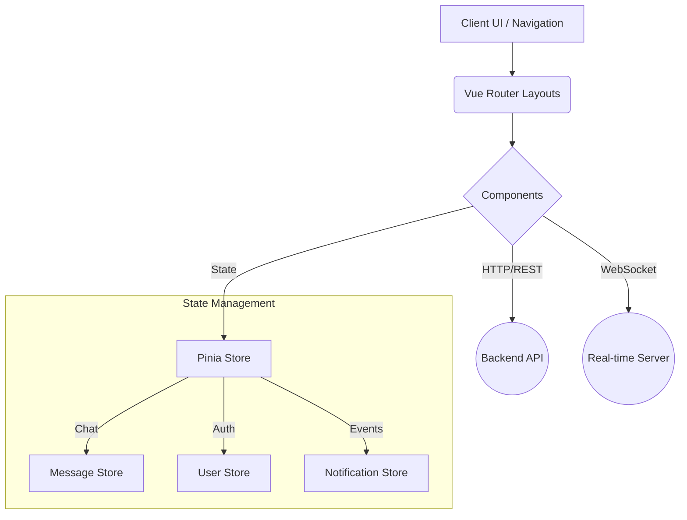

# Social Network - Frontend

A reactive Single Page Application (SPA) built to power a real-time social networking platform. 

The frontend uses state-of-the-art tooling to deliver a fluid, instant-feedback user experience utilizing WebSockets for live chat, notifications, and real-time feed updates.

## 🛠️ Technology Stack

- **Framework:** [Vue.js 3](https://vuejs.org/) (Composition API)
- **Build Tool:** [Vite](https://vitejs.dev/)
- **State Management:** [Pinia](https://pinia.vuejs.org/)
- **Routing:** [Vue Router 4](https://router.vuejs.org/)
- **Icons:** [Heroicons](https://heroicons.com/) & [Lucide](https://lucide.dev/)

## 🚀 Running Locally

Ensure you have Node.js installed, then follow these steps:

1. **Install Dependencies**
   Navigate to the `frontend` directory and run:
   ```bash
   npm install
   ```

2. **Start the Development Server**
   ```bash
   npm run dev
   ```
   *The application will typically be available at `http://localhost:5173`.*

3. **Build for Production**
   To create an optimized production build:
   ```bash
   npm run build
   ```

## 🏗️ Architecture Flow



## 🔌 Connection to Backend

The frontend requires the Golang backend to be running simultaneously (typically on `:8081`). 
Ensure your `.env` or API configuration files point to the correct local or production backend address for both standard HTTP REST requests and the active `ws://` connection required for messaging.
